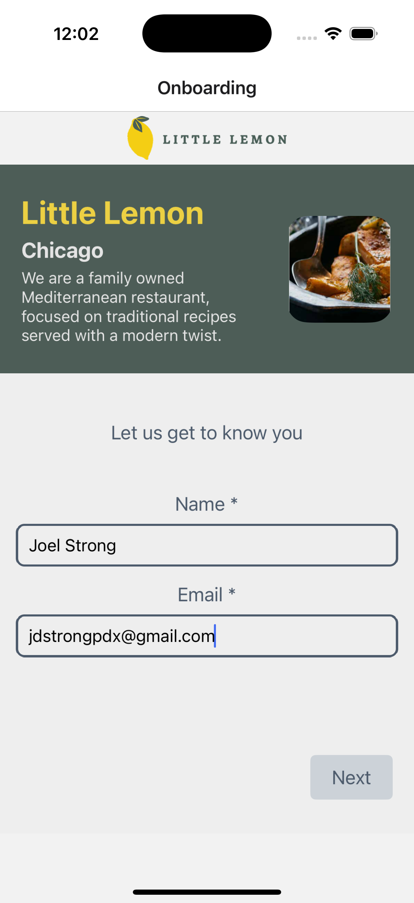
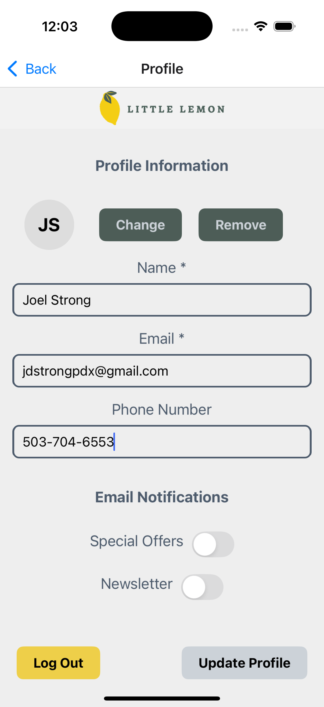
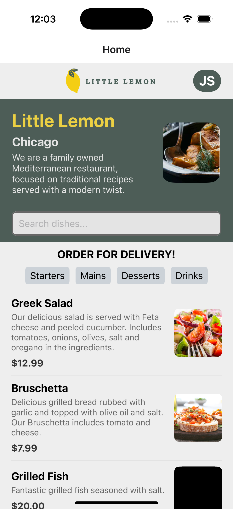
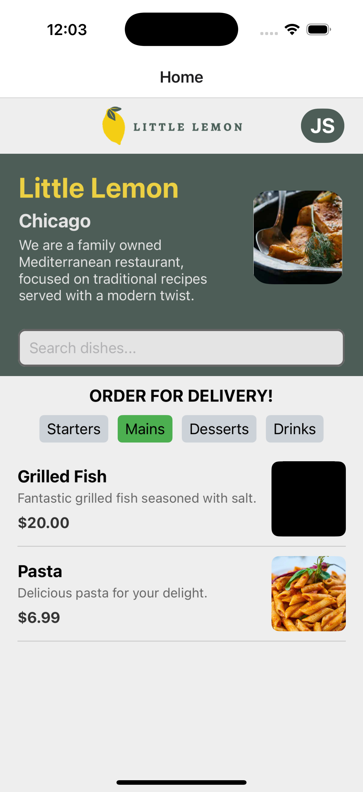

# Little Lemon Mobile Menu Application

This is a cross-platform mobile application built with **React Native** using **Expo**. The app provides a seamless user experience to browse and filter an online menu, store user information locally, and manage onboarding status.

---

## Features

- **Onboarding Process**:
    - Tracks onboarding status and saves user profile information locally using **AsyncStorage**.

- **Online Menu with Local Caching**:
    - Fetches the online menu using `fetch`.
    - Saves the menu locally via **expo-sqlite** to minimize redundant API calls.

- **Menu Filtering**:
    - Users can filter menu items by:
        - Character search (e.g., typing in a search bar).
        - Category selection (e.g., buttons to filter different menu categories).

- **Logout Functionality**:
    - Allows users to securely log out.
    - Automatically erases all locally stored data (user profile, onboarding status, and cached menu).

---

## Tech Stack

- **React Native**:
    - Cross-platform framework for building iOS and Android apps.
- **Expo**:
    - Simplifies development and supports easy environment configuration.
- **AsyncStorage**:
    - Used to persist user onboarding status and profile information locally.
- **expo-sqlite**:
    - Caches the online menu locally to reduce network calls.
- **fetch**:
    - Fetches the online menu data from the backend.

---

## Screenshots

Below are the key screens of the app:

1. **Onboarding Screen**  
   

2. **User Profile Screen**  
   

3. **Menu Screen**  
   

4. **Filtered Menu Results**  
   

---

